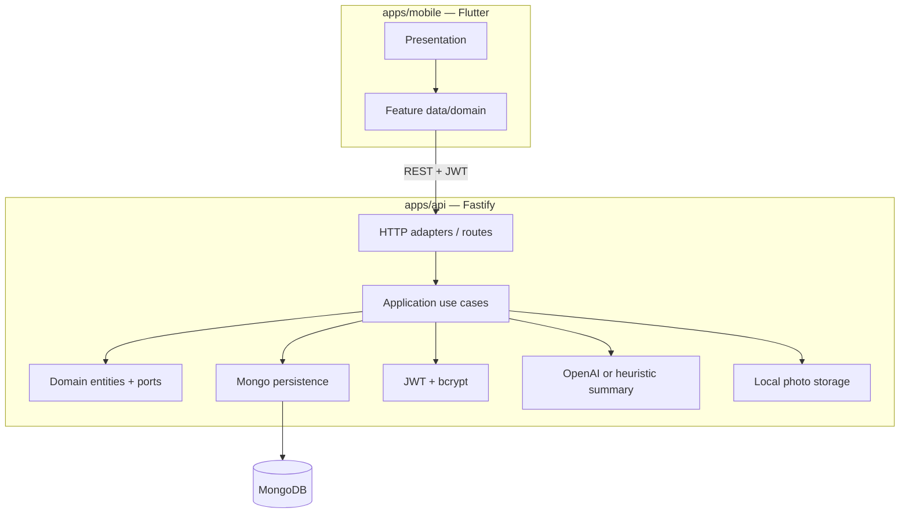

# RondaPro

B2B field audits / checklists for retail and facilities.

This repository ships **vertical slice #2**: authentication, checklist templates, **rondas**, **≥2 photos**, **1 LLM summary**, and **historial**.

## Architecture

Clean architecture with ports at the edges:



| Layer | Location | Responsibility |
|-------|----------|----------------|
| Domain | `apps/api/src/domain` | Entities + repository/token/hasher/storage/LLM ports |
| Application | `apps/api/src/application` | Auth, templates, start/complete ronda, photos, summary |
| Adapters | `apps/api/src/adapters` | Fastify HTTP, Mongoose, JWT, bcrypt, local files, OpenAI |
| Mobile | `apps/mobile/lib` | Feature folders with data / domain / presentation |

## Monorepo layout

```
RondaPro/
├── README.md
├── apps/
│   ├── api/          # Node.js + TypeScript + Fastify + MongoDB
│   └── mobile/       # Flutter (Material 3)
└── scripts/          # Optional helper scripts
```

## Environment variables (API)

Copy `apps/api/.env.example` → `apps/api/.env`:

| Variable | Description | Example |
|----------|-------------|---------|
| `MONGODB_URI` | MongoDB connection string | `mongodb://127.0.0.1:27017/rondapro` |
| `JWT_SECRET` | Signing secret (≥ 8 chars) | long random string |
| `JWT_EXPIRES_IN` | Token lifetime | `7d` |
| `HOST` | Bind address | `0.0.0.0` |
| `PORT` | HTTP port | `3000` |
| `CORS_ORIGIN` | CORS origin (`*` for local) | `*` |
| `UPLOAD_DIR` | Photo storage directory | `./uploads` |
| `OPENAI_API_KEY` | Optional. Enables real LLM summaries | `sk-...` |
| `OPENAI_BASE_URL` | OpenAI-compatible base URL | `https://api.openai.com/v1` |
| `OPENAI_MODEL` | Chat model | `gpt-4o-mini` |

If `OPENAI_API_KEY` is missing, completion still works and stores a **heuristic** summary (`summarySource: "heuristic"`).

## Run the API

Prerequisites: Node.js ≥ 20, MongoDB running locally (or Atlas URI).

```bash
cd apps/api
cp .env.example .env
npm install
npm run seed          # optional: demo user + sample template
npm run dev           # http://0.0.0.0:3000
```

Other scripts:

```bash
npm run typecheck
npm run build
npm start             # runs dist/ after build
```

### Demo credentials (seed)

- Email: `demo@rondapro.local`
- Password: `Demo1234!`

## Run Flutter

Prerequisites: Flutter SDK ≥ 3.5.

```bash
cd apps/mobile
flutter pub get
flutter run --dart-define=API_BASE_URL=http://127.0.0.1:3000
```

Android emulator tip: use `http://10.0.2.2:3000` to reach the host machine.

Screens in this slice: **Login / Register** → **Templates** → **Start ronda** → **Photos + complete** → **Historial**.

## Curl examples

Base URL: `http://127.0.0.1:3000`

### Login

```bash
TOKEN=$(curl -s -X POST http://127.0.0.1:3000/auth/login \
  -H 'Content-Type: application/json' \
  -d '{"email":"demo@rondapro.local","password":"Demo1234!"}' | jq -r .token)
echo "$TOKEN"
```

### List templates and start a ronda

```bash
TEMPLATE_ID=$(curl -s http://127.0.0.1:3000/templates \
  -H "Authorization: Bearer $TOKEN" | jq -r '.items[0].id')

RONDA=$(curl -s -X POST http://127.0.0.1:3000/rondas \
  -H "Authorization: Bearer $TOKEN" \
  -H 'Content-Type: application/json' \
  -d "{\"templateId\":\"$TEMPLATE_ID\",\"location\":\"Store 12\"}")
RONDA_ID=$(echo "$RONDA" | jq -r .id)
echo "$RONDA_ID"
```

### Save answers

```bash
curl -s -X PATCH http://127.0.0.1:3000/rondas/$RONDA_ID/answers \
  -H "Authorization: Bearer $TOKEN" \
  -H 'Content-Type: application/json' \
  -d '{
    "answers": [
      {"itemIndex":0,"label":"Entrance clean and clear","type":"bool","boolValue":true},
      {"itemIndex":1,"label":"Shelf stock notes","type":"text","textValue":"Back wall needs refill"},
      {"itemIndex":2,"label":"Photo of promo display","type":"photo"},
      {"itemIndex":3,"label":"Photo of emergency exit","type":"photo"},
      {"itemIndex":4,"label":"Emergency exits unobstructed","type":"bool","boolValue":true}
    ]
  }' | jq
```

### Upload ≥2 photos (tiny PNG)

```bash
PNG='iVBORw0KGgoAAAANSUhEUgAAAAEAAAABCAYAAAAfFcSJAAAADUlEQVR42mP8z8BQDwAEhQGAhKmMIQAAAABJRU5ErkJggg=='

curl -s -X POST http://127.0.0.1:3000/rondas/$RONDA_ID/photos \
  -H "Authorization: Bearer $TOKEN" \
  -H 'Content-Type: application/json' \
  -d "{
    \"photos\": [
      {\"filename\":\"promo.png\",\"mimeType\":\"image/png\",\"dataBase64\":\"$PNG\",\"itemIndex\":2},
      {\"filename\":\"exit.png\",\"mimeType\":\"image/png\",\"dataBase64\":\"$PNG\",\"itemIndex\":3}
    ]
  }" | jq
```

### Complete (generates 1 summary) + historial

```bash
curl -s -X POST http://127.0.0.1:3000/rondas/$RONDA_ID/complete \
  -H "Authorization: Bearer $TOKEN" | jq '.summary, .summarySource, .photos | length'

curl -s http://127.0.0.1:3000/rondas \
  -H "Authorization: Bearer $TOKEN" | jq
```

## API surface (slice #2)

| Method | Path | Auth | Notes |
|--------|------|------|-------|
| GET | `/health` | no | Mongo readiness |
| POST | `/auth/register` | no | returns `{ user, token }` |
| POST | `/auth/login` | no | returns `{ user, token }` |
| GET | `/templates` | JWT | owner's templates |
| POST | `/templates` | JWT | create |
| GET | `/templates/:id` | JWT | get one |
| PATCH | `/templates/:id` | JWT | partial update |
| DELETE | `/templates/:id` | JWT | 204 |
| GET | `/rondas` | JWT | historial |
| POST | `/rondas` | JWT | start from template |
| GET | `/rondas/:id` | JWT | get one |
| PATCH | `/rondas/:id/answers` | JWT | save checklist answers |
| POST | `/rondas/:id/photos` | JWT | JSON base64 photos |
| GET | `/rondas/:id/photos/:photoId` | JWT | binary image |
| POST | `/rondas/:id/complete` | JWT | requires ≥2 photos + 1 summary |

Completion rules:

- at least **2 photos** on the ronda
- required template items must be answered
- required `photo` items need at least one attached photo
- one summary is generated (`llm` if `OPENAI_API_KEY` is set, otherwise `heuristic`)

## Push slice #2

```bash
cd RondaPro
git add .
git commit -m "feat: slice 2 rondas + photos + LLM summary + historial"
git push origin main
```
