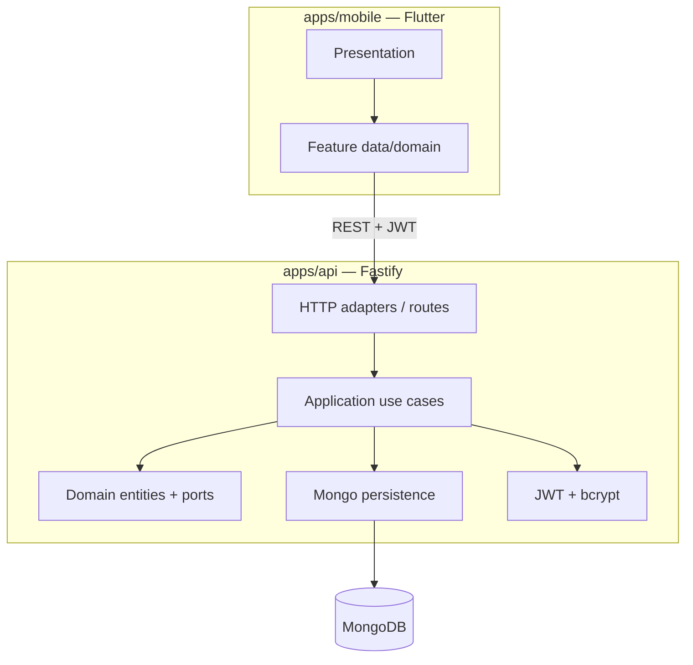

# RondaPro

B2B field audits / checklists for retail and facilities.

This repository ships **vertical slice #1**: authentication + checklist template CRUD (API + Flutter client).

> Rondas (completion), photo upload, LLM summary y historial quedan fuera de este slice — se agregarán en siguientes iteraciones.

## Architecture

Clean architecture with ports at the edges:



| Layer | Location | Responsibility |
|-------|----------|----------------|
| Domain | `apps/api/src/domain` | Entities + repository/token/hasher ports |
| Application | `apps/api/src/application` | Use cases (register, login, template CRUD) |
| Adapters | `apps/api/src/adapters` | Fastify HTTP, Mongoose, JWT, bcrypt |
| Mobile | `apps/mobile/lib` | Feature folders with data / domain / presentation |

## Monorepo layout

```
RondaPro/
├── README.md
├── apps/
│   ├── api/          # Node.js + TypeScript + Fastify + MongoDB
│   └── mobile/       # Flutter (Material 3)
└── scripts/          # Optional helper scripts
```

## Environment variables (API)

Copy `apps/api/.env.example` → `apps/api/.env`:

| Variable | Description | Example |
|----------|-------------|---------|
| `MONGODB_URI` | MongoDB connection string | `mongodb://127.0.0.1:27017/rondapro` |
| `JWT_SECRET` | Signing secret (≥ 8 chars) | long random string |
| `JWT_EXPIRES_IN` | Token lifetime | `7d` |
| `HOST` | Bind address | `0.0.0.0` |
| `PORT` | HTTP port | `3000` |
| `CORS_ORIGIN` | CORS origin (`*` for local) | `*` |

## Run the API

Prerequisites: Node.js ≥ 20, MongoDB running locally (or Atlas URI).

```bash
cd apps/api
cp .env.example .env
npm install
npm run seed          # optional: demo user + sample template
npm run dev           # http://0.0.0.0:3000
```

Other scripts:

```bash
npm run typecheck
npm run build
npm start             # runs dist/ after build
```

### Demo credentials (seed)

- Email: `demo@rondapro.local`
- Password: `Demo1234!`

## Run Flutter

Prerequisites: Flutter SDK ≥ 3.5.

```bash
cd apps/mobile
flutter pub get
flutter run --dart-define=API_BASE_URL=http://127.0.0.1:3000
```

Android emulator tip: use `http://10.0.2.2:3000` to reach the host machine.

Screens in this slice: **Login / Register** → **Templates list** → **Create template**.

## Curl examples

Base URL: `http://127.0.0.1:3000`

### Health

```bash
curl -s http://127.0.0.1:3000/health | jq
```

### Register

```bash
curl -s -X POST http://127.0.0.1:3000/auth/register \
  -H 'Content-Type: application/json' \
  -d '{"email":"auditor@example.com","password":"Secret123!","name":"Ana Auditor"}' | jq
```

### Login

```bash
TOKEN=$(curl -s -X POST http://127.0.0.1:3000/auth/login \
  -H 'Content-Type: application/json' \
  -d '{"email":"demo@rondapro.local","password":"Demo1234!"}' | jq -r .token)
echo "$TOKEN"
```

### List templates

```bash
curl -s http://127.0.0.1:3000/templates \
  -H "Authorization: Bearer $TOKEN" | jq
```

### Create template

```bash
curl -s -X POST http://127.0.0.1:3000/templates \
  -H "Authorization: Bearer $TOKEN" \
  -H 'Content-Type: application/json' \
  -d '{
    "name": "Closing checklist",
    "description": "End-of-day store close",
    "items": [
      {"label": "Lights off", "required": true, "type": "bool"},
      {"label": "Notes", "required": false, "type": "text"},
      {"label": "Front door photo", "required": true, "type": "photo"}
    ]
  }' | jq
```

### Get / update / delete

```bash
ID=<template-id>

curl -s http://127.0.0.1:3000/templates/$ID \
  -H "Authorization: Bearer $TOKEN" | jq

curl -s -X PATCH http://127.0.0.1:3000/templates/$ID \
  -H "Authorization: Bearer $TOKEN" \
  -H 'Content-Type: application/json' \
  -d '{"description":"Updated description"}' | jq

curl -s -o /dev/null -w "%{http_code}\n" -X DELETE \
  http://127.0.0.1:3000/templates/$ID \
  -H "Authorization: Bearer $TOKEN"
```

## API surface (slice #1)

| Method | Path | Auth | Notes |
|--------|------|------|-------|
| GET | `/health` | no | Mongo readiness |
| POST | `/auth/register` | no | returns `{ user, token }` |
| POST | `/auth/login` | no | returns `{ user, token }` |
| GET | `/templates` | JWT | owner's templates |
| POST | `/templates` | JWT | create |
| GET | `/templates/:id` | JWT | get one |
| PATCH | `/templates/:id` | JWT | partial update |
| DELETE | `/templates/:id` | JWT | 204 |

Checklist item shape: `{ label, required, type: "text" \| "bool" \| "photo" }`.

## Push to GitHub

```bash
cd RondaPro
git init
git add .
git commit -m "feat: vertical slice #1 — auth + checklist templates"
git remote add origin https://github.com/Gabyresina15/RondaPro.git
git branch -M main
git push -u origin main
```

Or unzip `RondaPro.zip` and push from there.
